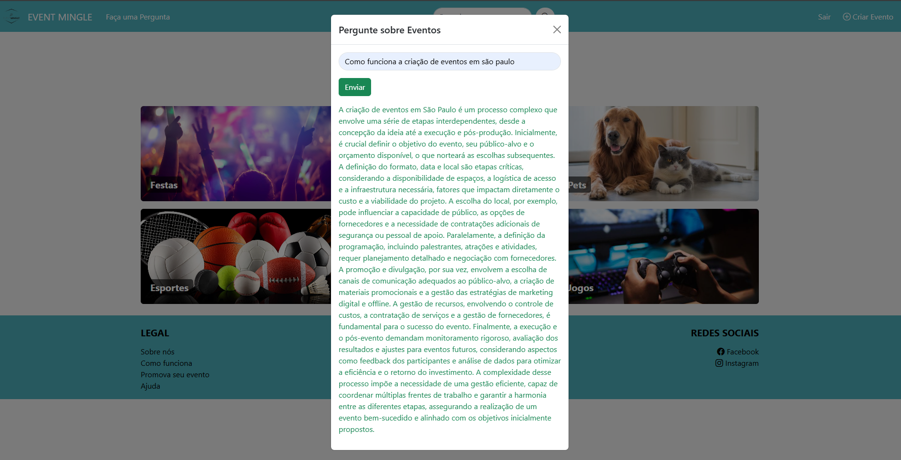

IA Utilizada: [Gemini](https://aistudio.google.com/apikey).

Proposta: O usuário pode fazer perguntas para a IA sobre eventos.

Para rodar o sistema, é necessário primeiramente acessar o diretório api, criar um arquivo **.env** e seguir o que está escrito no arquivo .env example. Após isso, ir no terminal e digitar **npm install** para instalar todas as dependências necessárias para rodar o projeto. Para iniciar a api, digite **npm start**.

Agora, no diretório web, faça o **npm install** e **npm start** novamente para poder visualizar a interface e testar o projeto em funcionamento.

Outra maneira de utilizar o sistema é tendo o Docker Desktop instalando na sua máquina Windows, assim, é possível rodar os containers através do terminal utilizando o comando **docker compose up -d"**. É necessário recursos mais potentes para rodar com docker, mas com apenas um comando você já pode testar o projeto.
